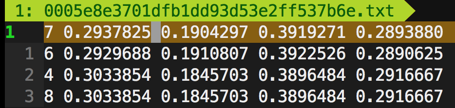

# VinBigData Chest X-ray Abnormalities Detection
Competition [Link](https://www.kaggle.com/c/vinbigdata-chest-xray-abnormalities-detection/overview)  
Resources [doc](https://docs.google.com/document/d/1fAKkW82ShSpERiUP_TmLPaP-cw_PTVhSRulDIjG6jWg/edit#heading=h.zfdbsf1l98sg)

# Preprocessing
After running the following
```sh
python3 preprocessing/preprocessing_mp.py \
    --train-csv /work/VinBigData/raw_data/train.csv \
    --train-dicom-dir /work/VinBigData/raw_data/train/ \
    --save-base-dir SAVE_BASE_DIR \
    --workers 32
```
The processed image `*.npz` files will be stored in `$SAVE_BASE_DIR/img_npz`,  
and bounding box `*.txt` file will be in `$SAVE_BASE_DIR/bbox_txt`

### Bounding Boxes in `txt` files
The `*.txt` file specifications are:
- One row per object
- Each row is `class x_min y_min x_max y_max` format
- Box coordinates are in **normalized** format (from 0 - 1). If your boxes are in pixels, divide `x_min` and `x_max` by image width, and `y_min` and `y_max` by image height.)  
For example,


## Update log
[2021-02-01] First version of preprocessing, including converting image to `*.npz` files and bounding boxes info. to `*.txt` files
